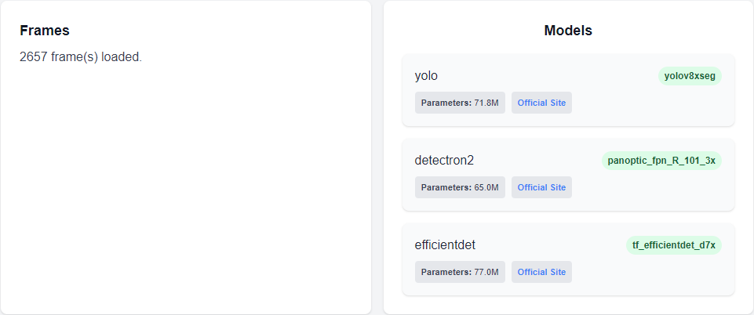
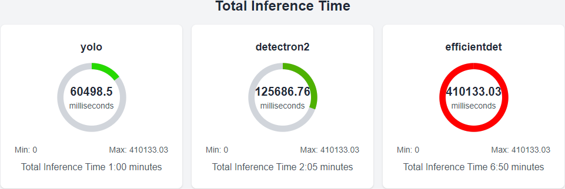
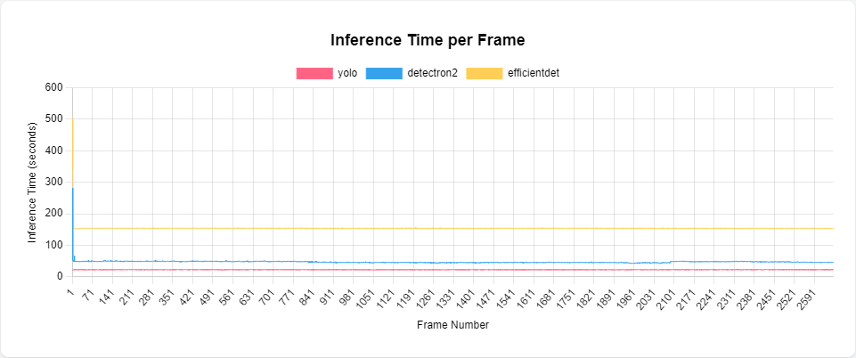
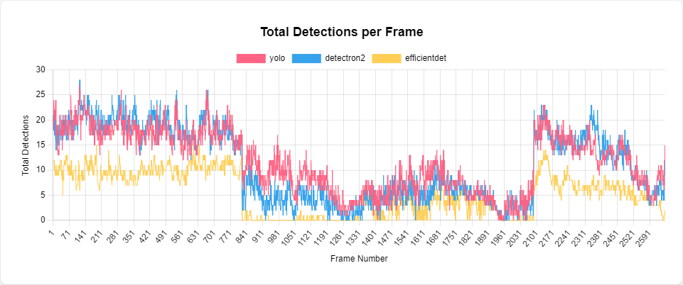
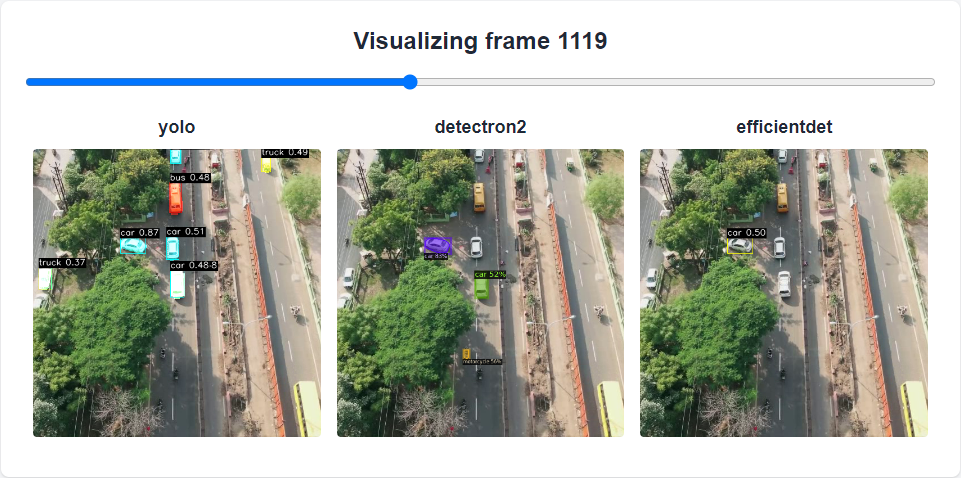
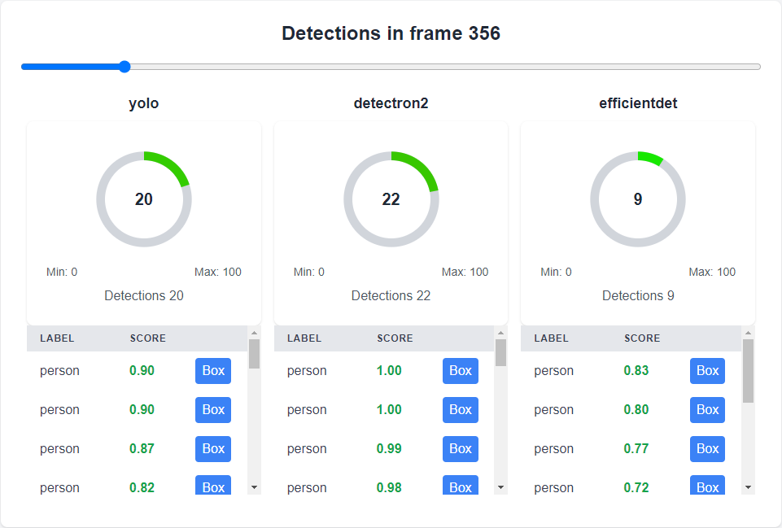
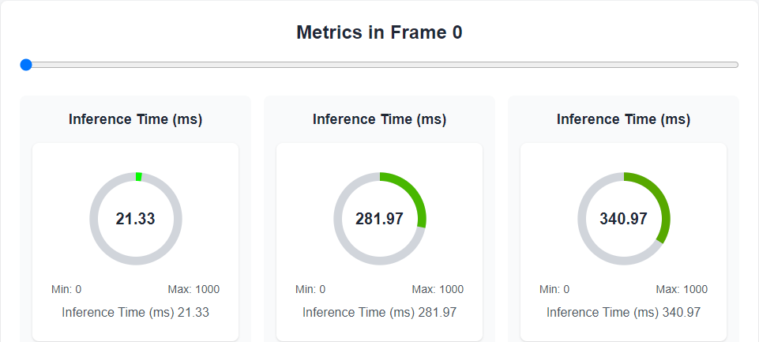

# Computer Vision (Frontend) Module for IU University - Research Project

This project is a React application built with Next.js and Tailwind CSS, designed to provide a comparison tool for various computer vision models using frontend components. The goal is to visualize inference data (object detection and segmentation) generated from the backend models, allowing detailed analysis through widgets, charts, and frame-by-frame views.

## Introduction

This frontend application complements the [computer-vision backend](https://github.com/hector-oviedo/computer-vision), where object detection and segmentation models (YOLO, EfficientDet, Detectron2, sam2) generate inference data. Once this data is loaded into the frontend, it can be visualized through a dashboard that provides side-by-side comparisons of the models' performance.

The primary function of this project is to facilitate performance analysis by visualizing the inference data from the models. Users can explore various metrics such as inference time, detection accuracy, and more, using intuitive widgets and charts.

## Installation

### Prerequisites

This project requires **Node.js** to run locally. You can download Node.js from the official website: [Node.js Official Site](https://nodejs.org/).

### Steps

1. Clone this repository:
    ```bash
    git clone https://github.com/hector-oviedo/computer-vision-frontend
    ```

2. Navigate to the project folder and install the dependencies:
    ```bash
    npm install
    ```

3. Start the development server:
    ```bash
    npm run dev
    ```

4. The app will be available at `http://localhost:3000`.

### Preparing the Backend Data

To properly use this frontend, ensure you have run all the scripts from the [computer-vision backend repository](https://github.com/hector-oviedo/computer-vision) and generated the necessary output files. You will need to copy the following folders into this frontend's `public/` directory:

- **output/** (from the backend)
- **data/** (from the backend)

The **public/config.json** file is critical for loading the models into the dashboard. The `config.json` file has the following structure:

### Preparing the Backend Data

To properly use this frontend, ensure you have run all the scripts from the [computer-vision backend repository](https://github.com/hector-oviedo/computer-vision) and generated the necessary output files. You will need to copy the following folders into this frontend's `public/` directory:

- **output/** (from the backend)
- **data/** (from the backend)

Alternatively, you can clone the frontend repository and use the actual data already present. If you prefer to use your own data, simply remove the existing **output/** and **data/** folders and upload your backend-generated files following the project steps.

The **public/config.json** file is critical for loading the models into the dashboard. The `config.json` file has the following structure:

```json
{
    "rawFramesPath": "data/frames",
    "modelsOutputs": "/output/logs",
    "modelsInferenceFramesPath": "/output/frames/",
    "models": [
        "yolo",
        "detectron2",
        "efficientdet"
    ]
}
```
You will need to manually add the models in the `models` array by specifying the model identifiers, as documented in the backend repository. Simply adding the names of the models will allow the frontend to function with the output and data from the backend. This makes the project "plug and play" after copying the necessary files.

## Project Workflow

Once the setup is complete and the data is copied into the frontend, you can start visualizing the models' performance. The dashboard provides several tools and widgets to assist in analyzing the results.

### 1. Dashboard Overview

- **Total Frames**: Displays the total number of frames processed by the models.
- **Model Metadata**: Shows the loaded models, their identifiers, parameters (weights), and links to their official documentation, as defined in the backend project.



### 2. Metrics and Charts

- **GAUGE - Total Inference Time**: A gauge shows the total inference time (in milliseconds and minutes) for each model.


  
- **CHART - Inference Time per Frame**: A chart that shows the inference time (in milliseconds) for each frame. The X-axis represents the frame number, and the Y-axis represents the inference time. This helps identify key frames with high or low inference times for deeper analysis.



- **CHART - Total Detections per Frame**: Another chart showing the total number of detections per frame for each model. The X-axis represents the frame number, and the Y-axis represents the number of detections. This chart highlights frames where certain models detect more objects (or none), making it easier to spot performance differences.



### 3. Frame Comparison

- **Side-by-Side Frame Comparison**: Users can visualize the frame outputs from each model. A slider allows you to navigate through the frames, comparing the segmentation, object detection, labels, and bounding boxes across the models.



- **Detailed Detection View**: This widget allows users to compare individual detections per frame. You can view each detection's label, score, and bounding box. Each detection has a button that opens a popup, displaying an isolated view of the detection for easier analysis.



- **Isolated Detection View**: When clicking the detection button, you can see an isolated image of the specific detection with an option to show or hide the detection overlay.


### 4. System Metrics Comparison

A set of gauges will display additional metrics for each model, allowing for side-by-side comparison of:
- Inference Time (ms)
- Total Time (ms)
- CPU Usage (%)
- CPU RAM Usage (MB)
- GPU VRAM Usage (MB)
- GPU VRAM Reserved (MB)



### 5. Configuration

The project includes a configuration button that allows users to change the theme color and text size. This can be accessed through the top-left corner of the application. Additionally, a help button in the top-right corner provides instructions on the required file structure and usage of the dashboard.

## Limitations

- **Manual Model Configuration**: Currently, models need to be manually added to the `config.json` file. In the future, automation might be added depending on user requests.
- **SAM2 Not Included**: The frontend currently supports YOLOv8, EfficientDet, and Detectron2. SAM2 is not integrated into this version.
- **Pending Enhancements**: Additional metrics, such as confusion matrix analysis, are planned for future updates.

## Backend Integration

This project works in conjunction with the [computer-vision backend](https://github.com/hector-oviedo/computer-vision), which provides the necessary inference data in the form of JSON logs and processed frames. Ensure the backend data is correctly copied to the `public/` folder as described above.

## License

This project is licensed under the MIT License, which allows free use, distribution, and modification of the software for personal or commercial purposes. The project is intended for educational use, and contributions are welcomed.

You are free to:
- Use the project for any purpose.
- Modify the code as needed.
- Share and distribute it as you see fit.

The full license can be found [here](LICENSE).
